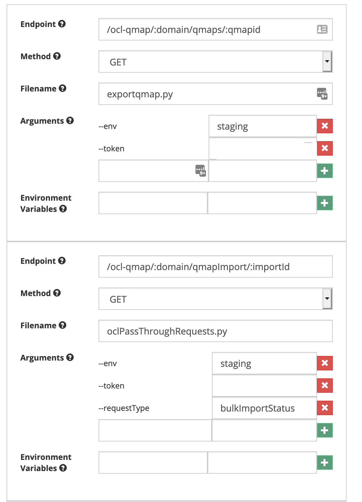
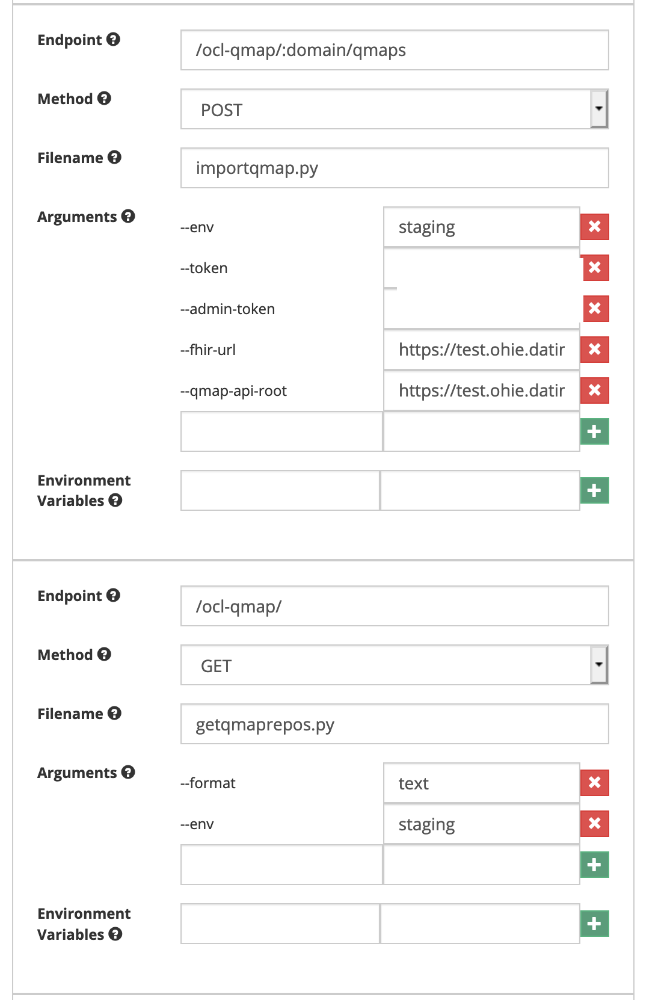
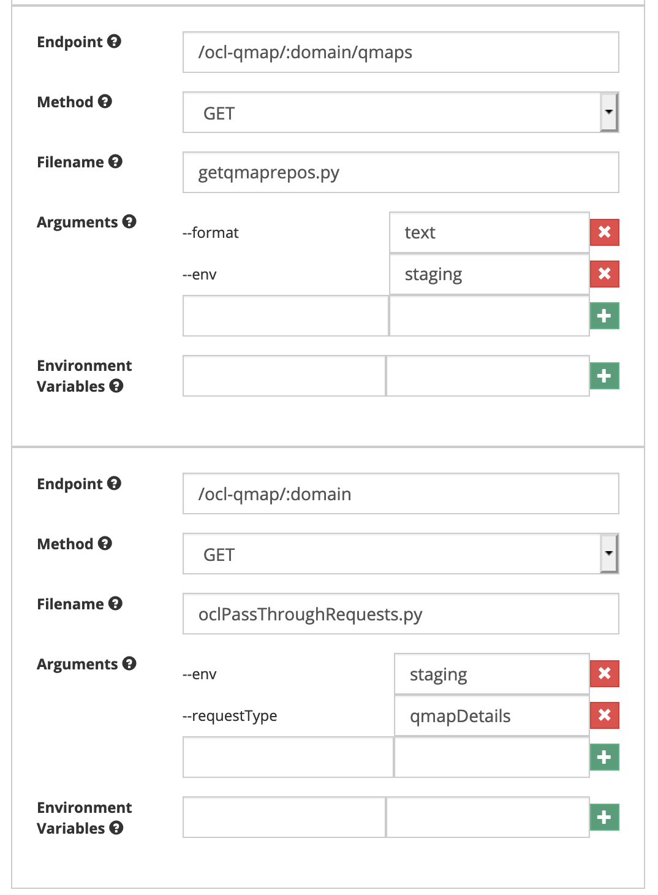
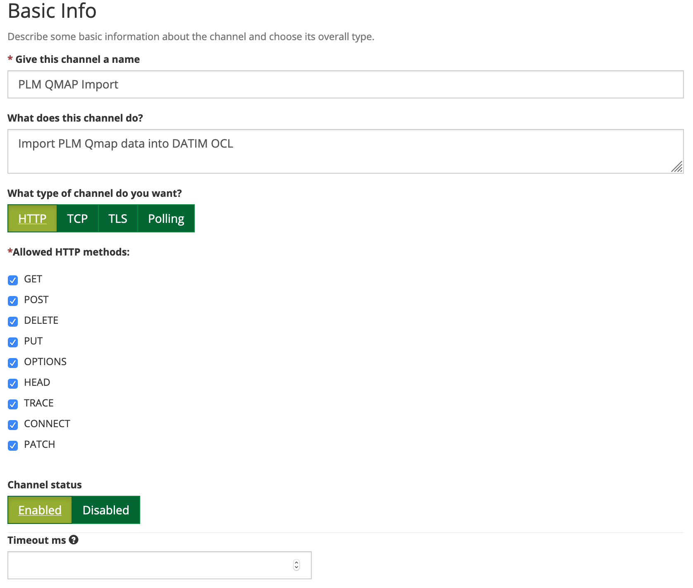
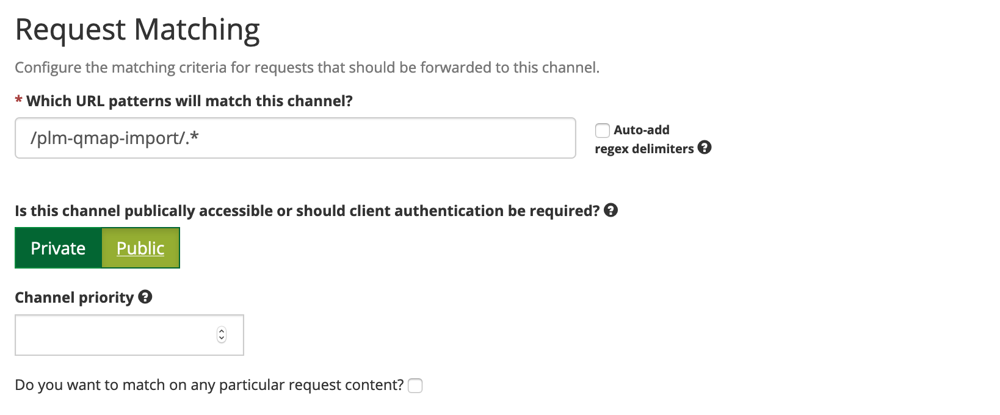
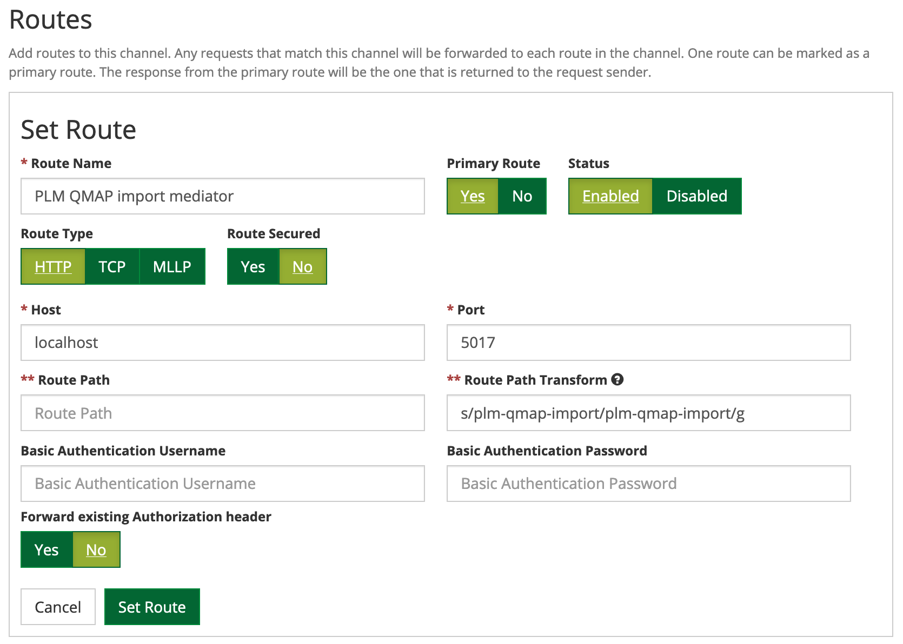
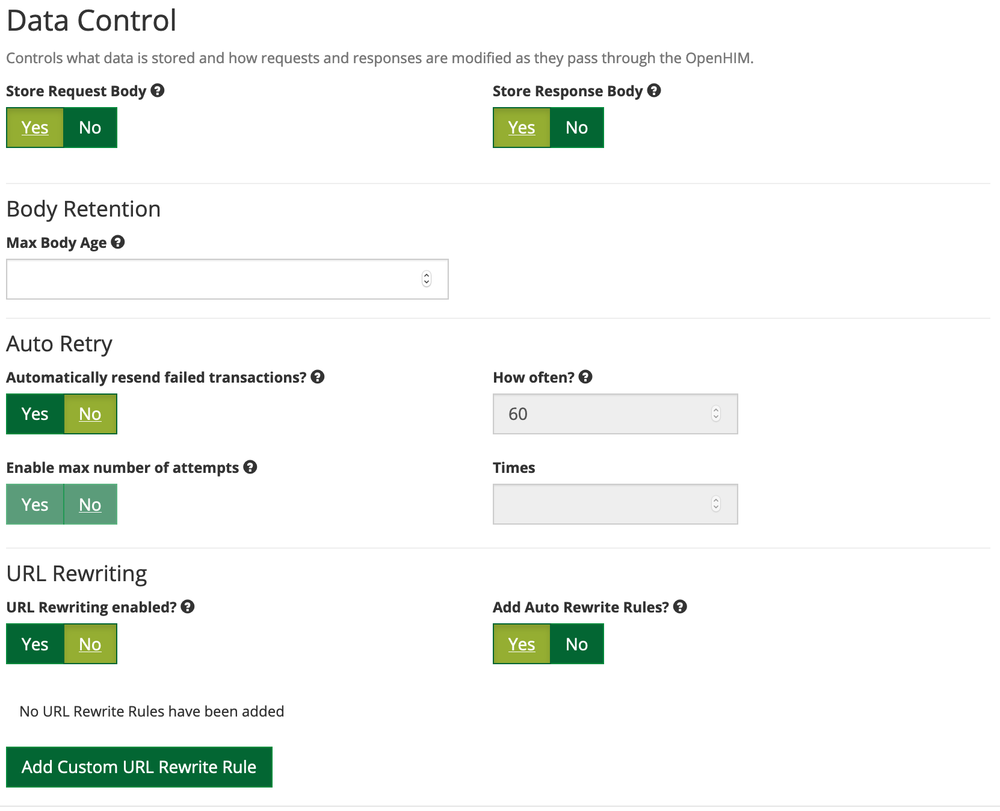

# Description

This is a passthrough mediator for to storing and retrieving PLM questionnare mappings to and from OCL through OpenHIM

# Installation

1.	Clone the openhim-mediator-plm-qmap repo into the /usr/share folder.
2.	Create “openhim-mediator-plm-qmap.service” file with the following content and save it in /etc/system/system/

```
[Unit]
Description=OpenHIM PLM QMAP mediator
[Service]
WorkingDirectory=/usr/share/openhim-mediator-plm-qmap
ExecStart=/usr/bin/npm start
Restart=always
StandardOutput=syslog
StandardError=syslog
SyslogIdentifier=plm-qmap-mediator
Environment=NODE_ENV=production
User=openhim-core
Group=openhim-core
[Install]
```

3.	Run `systemctl start openhim-mediator-plm-qmap.service`


4. After successful installation, configure the mediator with the following settings - 
<p align="center">

  
  
  </p>

5. Create a channel through which the mediator is accessed and use the following settings -


  
  
   
  </p>

